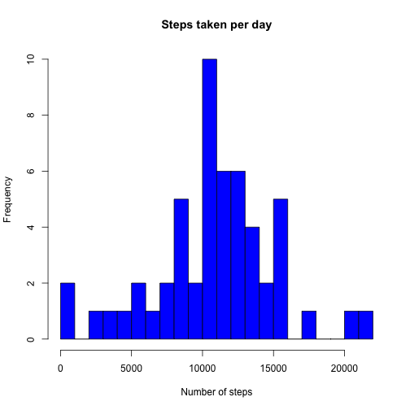
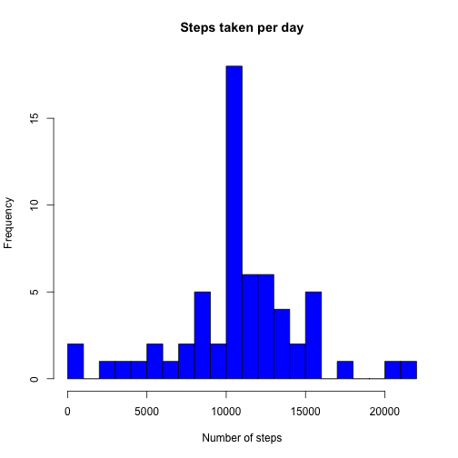
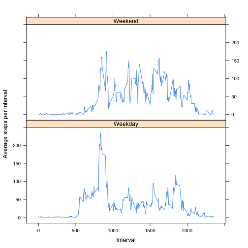

# Reproducible Research: Peer Assessment 1


## Loading and preprocessing the data

First we need to load the data from activity.csv 


```r
df <- read.csv("activity.csv")
```


Next we load the plyr library and use the ddply function to create 

- a summary data frame byDaySummary with the total number of steps per day 
- a summary data frame byIntervalSummary with the mean number of steps per interval across the two month period. 


```r
library(plyr)

byDaySummary <- ddply(df, .(date), summarise, stepsPerDay = sum(steps, na.rm = TRUE))

byIntervalSummary <- ddply(df, .(interval), summarise, averageStepsPerInterval = mean(steps, 
    na.rm = TRUE))
```


The interval variable measures five minute intervals from 0 to 55 before incremeting an hour. To fix this for some later plots, we next create a vector that holds 24 hours worth of five minute intervals in standard POSIXlt format and bind this onto the byIntervalSummary data frame.


```r
intervals24hour <- strptime(formatC(df$interval[1:288], width = 4, format = "d", 
    flag = "0"), "%H%M")
byIntervalSummary <- cbind(intervals24hour, byIntervalSummary)
```


## What is mean total number of steps taken per day?

First let's get an idea of the distribution of the steps taken per day with a quick histogram

```r
hist(byDaySummary$stepsPerDay, breaks = 30, col = "blue", main = "Steps taken per day", 
    xlab = "Number of steps")
```

 

```r
meanStepsPerDay <- round(mean(byDaySummary$stepsPerDay))
medianStepsPerDay <- round(median(byDaySummary$stepsPerDay))
```


The mean number of steps per day is 9354

The median number of steps per day is 1.0395 &times; 10<sup>4</sup>


## What is the average daily activity pattern?

Again to get an overview of the average daily activity pattern, we can plot the number of steps in each interval averaged across the two months


```r
plot(byIntervalSummary$intervals24hour, byIntervalSummary$averageStepsPerInterval, 
    type = "l", xlab = "Interval", ylab = "Average steps")
```

 


From this we can extract the interval with the maximum average activity


```r
maxActivityInterval <- byIntervalSummary$interval[which.max(byIntervalSummary$averageStepsPerInterval)]
```


The maximum average activty is at interval number 835 or 8:35am

## Imputing missing values

Let's now run a quick check on how much data is missing in the original data set.


```r
numberOfMissingValues <- sum(is.na(df$steps))
```


Turns out that there are 2304 missing values in the steps column.

The next piece of codes replaces missing steps values with the average for that interval across all days and places it in a data frame called dfImputed


```r
locationNA <- is.na(df$steps)
intervalMeansExtension <- as.data.frame(rep(byIntervalSummary$averageStepsPerInterval, 
    times = 61))
names(intervalMeansExtension) <- c("intervalMeansExtension")
dfImputed <- cbind(df, intervalMeansExtension)
dfImputed$steps[locationNA] <- dfImputed$intervalMeansExtension[locationNA]
```


Now we want to look at the same steps frequency histogram as before and examin the impact of our missing value imputation.


```r
byDaySummaryImputed <- ddply(dfImputed, .(date), summarise, stepsPerDay = sum(steps, 
    na.rm = TRUE))
```


```r
hist(byDaySummaryImputed$stepsPerDay, breaks = 30, col = "blue", main = "Steps taken per day with imputed values for missing values", 
    xlab = "Number of steps")
```

 

```r
meanStepsPerDayImputed <- round(mean(byDaySummaryImputed$stepsPerDay))
medianStepsPerDayImputed <- round(median(byDaySummaryImputed$stepsPerDay))
```


With missing values replaced with the corresponding interval averages we have

The mean number of steps per day is 1.0766 &times; 10<sup>4</sup>

The median number of steps per day is 1.0766 &times; 10<sup>4</sup>

This is significantly different from our original results when we ignored NAs. Both the mean number of steps and the median number of steps are higher when using an imputed values of interval average in place of NA.

## Are there differences in activity patterns between weekdays and weekends?

Now we want to compare activity difference between weekdays and weekends. First we need to create a suitable factor variable from the date column.


```r
df$DayOfWeek <- as.factor(weekdays(as.Date(df$date)))
levels(df$DayOfWeek) <- c("Weekday", "Weekday", "Weekend", "Weekend", "Weekday", 
    "Weekday", "Weekday")
```


Now again we make a by interval summary of steps taken but this time seperating out into the weekends from the weekdays before we make the average. Then we can generate a plot of interval vs average steps per interval conditioned on weekday vs weekend.


```r
byIntervalSummaryWeekdayWeekend <- ddply(df, .(interval, DayOfWeek), summarise, 
    averageStepsPerInterval = mean(steps, na.rm = TRUE))
```


```r
library(lattice)

xyplot(byIntervalSummaryWeekdayWeekend$averageStepsPerInterval ~ byIntervalSummaryWeekdayWeekend$interval | 
    byIntervalSummaryWeekdayWeekend$DayOfWeek, type = "l", layout = c(1, 2), 
    xlab = "Interval", ylab = "Average steps per interval")
```

 


It is clear that there is significant difference between the weekend and weekday activity.
